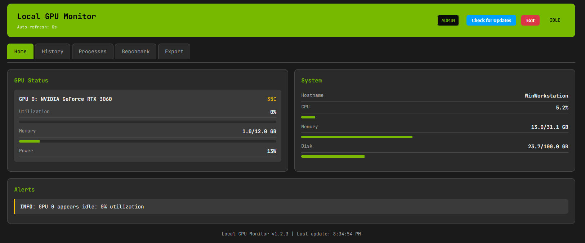
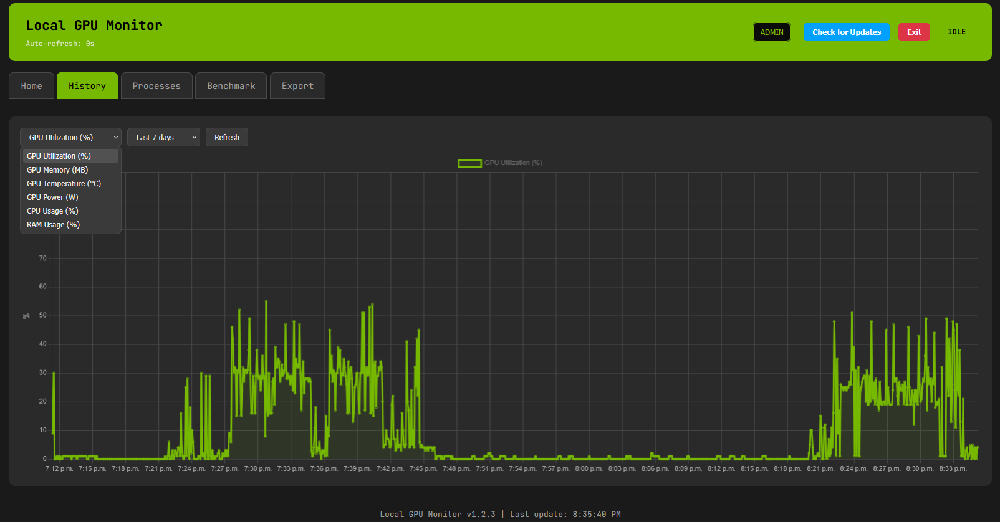
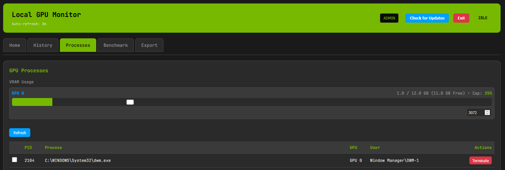
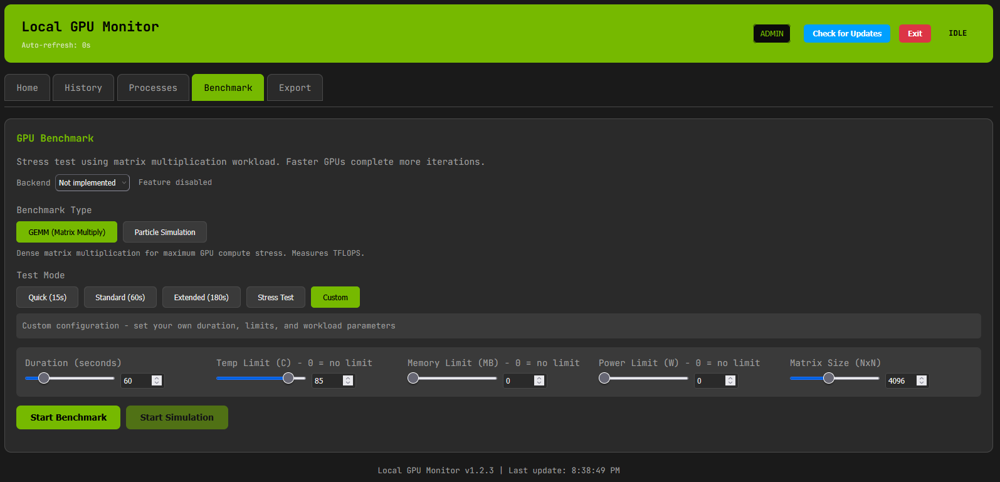
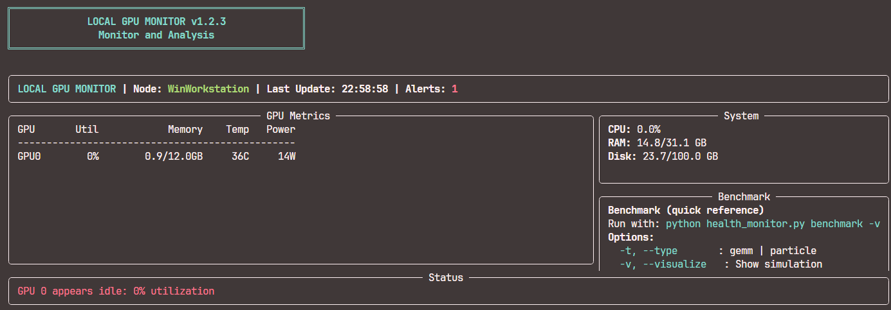

<div align="center">
  <a href="../README.md">🇺🇸 Inglés</a> |
  <a href="README.de.md">🇩🇪 Alemán</a> |
  <a href="README.fr.md">🇫🇷 Francés</a> |
  <a href="README.es.md">🇪🇸 Español</a> |
  <a href="README.ja.md">🇯🇵 Japonés</a> |
  <a href="README.zh.md">🇨🇳 Chino</a> |
  <a href="README.pt.md">🇵🇹 Portugués</a> |
  <a href="README.ko.md">🇰🇷 Coreano</a>
</div>

<div style="text-align:center; margin:18px 0;">
  
</div>

> *MyGPU: Herramienta de gestión de GPU ligera: un envoltorio compacto para `nvidia-smi` con un tablero web limpio.*


## Galería

<details>
  <summary>Tablero web</summary>
  <div style="display:flex; overflow-x:auto; gap:10px; padding:12px 0; scroll-snap-type:x mandatory; -webkit-overflow-scrolling:touch;">
    <!-- Utilizar la relación de aspecto 1624x675 para las imágenes del carrusel -->
    <div style="flex:0 0 100%; scroll-snap-align:center; aspect-ratio:1624/675; display:flex; align-items:center; justify-content:center;">
      
    </div>
    <div style="flex:0 0 100%; scroll-snap-align:center; aspect-ratio:1624/675; display:flex; align-items:center; justify-content:center;">
      
    </div>
    <div style="flex:0 0 100%; scroll-snap-align:center; aspect-ratio:1624/675; display:flex; align-items:center; justify-content:center;">
      
    </div>
    <div style="flex:0 0 100%; scroll-snap-align:center; aspect-ratio:1624/675; display:flex; align-items:center; justify-content:center;">
      
    </div>
  </div>
</details>
<details>
  <summary>CLI</summary>
  <div style="display:flex; overflow-x:auto; gap:10px; padding:12px 0; scroll-snap-type:x mandatory; -webkit-overflow-scrolling:touch;">
    <div style="flex:0 0 100%; scroll-snap-align:center; aspect-ratio:1624/675; display:flex; align-items:center; justify-content:center;">
      
    </div>
    <!-- Agregar más imágenes CLI según sea necesario -->
  </div>
</details>

### ¿Por qué usar esto?

- **Ligero**: Bajo consumo de recursos.
- **Versátil**: Funciona como herramienta de línea de comandos o un tablero web completo.
- **Orientado a administradores**: Incluye características como **restricciones de VRAM** (terminación automática de procesos que superen los límites) y **listas de vigilancia**.
- **Amigable con los desarrolladores**: Herramientas integradas para pruebas de estrés y simulación (GEMM, física de partículas).

---

## Características

- **Monitoreo en tiempo real**:
  - Métricas detalladas de GPU (utilización, VRAM, potencia, temperatura).
  - Métricas del sistema (CPU, RAM, etc.).

- **Administración y restricciones**:
  - **Límites de VRAM**: Establecer límites duros de uso de VRAM por GPU.
  - **Terminación automática**: Terminar automáticamente procesos que violen las políticas de VRAM (solo para administradores).
  - **Listas de vigilancia**: Monitorear PIDs o nombres de procesos específicos.

- **Pruebas y simulación**:
  - **Pruebas de estrés**: Cargas de trabajo GEMM configurables para probar el throtting térmico y la estabilidad.
  - **Simulación visual**: Simulación interactiva de física de partículas para visualizar la carga de trabajo de la GPU.

---

## Roadmap y trabajo futuro

¡Las contribuciones son bienvenidas! Los futuros puntos principales a cubrir serían:

- **Soporte multi-GPU**: Manejo mejorado para configuraciones multi-tarjeta y topologías NVLink.
- **Contenedorización**: Soporte oficial para Docker para una fácil implementación en entornos contenedorizados.
- **Acceso remoto**: Integración de túneles SSH y gestión remota segura.
- **Compatibilidad multiplataforma**:
  - [ ] Linux (foco en Ubuntu/Debian).
  - [ ] macOS (monitoreo de Apple Silicon).
- **Independencia de hardware**:
  - [ ] Soporte para AMD ROCm.
  - [ ] Soporte para Intel Arc.
- ~~**Documentación multilingüe**: Apoyo a los lenguajes de documentación más populares de GitHub.~~

Consulte [CONTRIBUTING.md](../CONTRIBUTING.md) para saber cómo involucrarse.

---

## Requisitos

- **OS**: Windows 10/11
- **Python**: 3.10+
- **Hardware**: GPU NVIDIA con controladores instalados.
- **CUDA**: Toolkit 12.x (requerido estrictamente para características de pruebas y simulación).
  - *Nota: Si CUDA 12.x no se detecta, las características de benchmarking se desactivarán.*

---

## Instalación

La herramienta admite una instalación modular para adaptarse a sus necesidades:

### 1. Mínimo (solo CLI)

Ideal para servidores sin cabeza o monitoreo en segundo plano.

- Interfaz de línea de comandos.
- Métricas básicas del sistema y la GPU.

### 2. Estándar (CLI + Tablero web)

Ideal para la mayoría de los usuarios.

- Incluye el tablero web.
- Puntos finales de API REST.
- Gráficos en tiempo real.

### 3. Completo (Estándar + Visualización)

Ideal para desarrollo y pruebas de estrés.

- Incluye simulación de partículas.
- Dependencias de PyTorch/CuPy para benchmarking.

### Inicio rápido

1. **Descargar** la última versión o clonar el repositorio.
2. **Ejecutar el script de configuración**:

  ```powershell
  .\setup.ps1
  ```

3. **Iniciar**:

```powershell
# Iniciar el tablero web (Estándar/Completo)
python health_monitor.py web

# Iniciar la CLI
python health_monitor.py cli
```