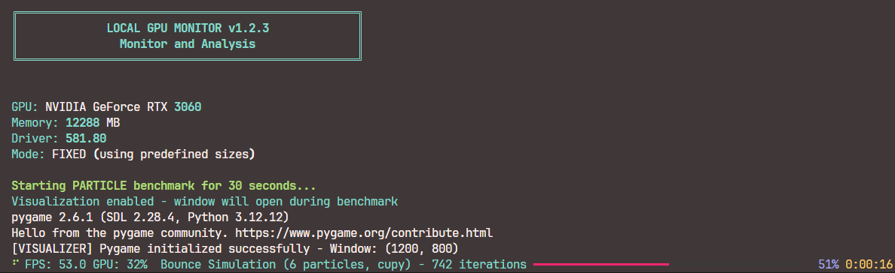
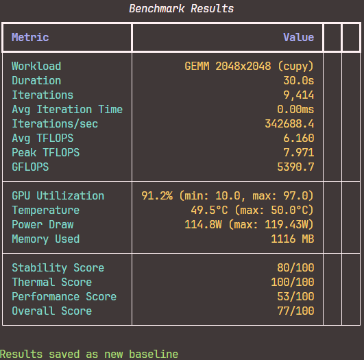
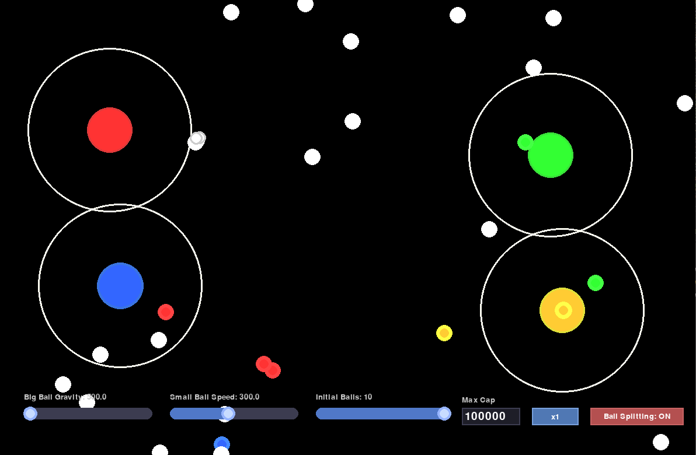
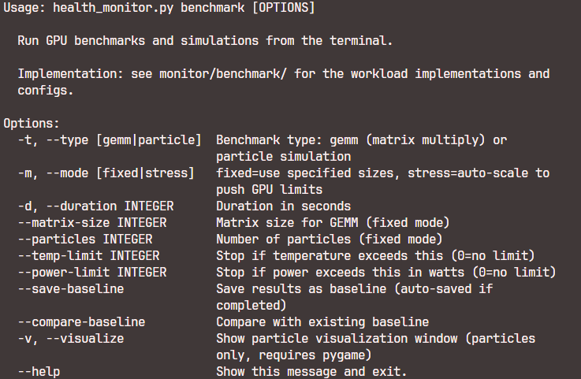

<!-- HTML_BLOCK:1... -->

<div align="center">
  <a href="../README.md">🇺🇸 English</a> |
  <a href="../locales/README.de.md">🇩🇪 Deutsch</a> |
  <a href="../locales/README.fr.md">🇫🇷 Français</a> |
  <a href="../locales/README.es.md">🇪🇸 Español</a> |
  <a href="../locales/README.ja.md">🇯🇵 日本語</a> |
  <a href="../locales/README.zh.md">🇨🇳 中文</a> |
  <a href="../locales/README.pt.md">🇵🇹 Português</a> |
  <a href="../locales/README.ko.md">🇰🇷 한국어</a> |
  <a href="../locales/README.hi.md">🇮🇳 हिंदी</a>
</div>

<!-- HTML_BLOCK:2... -->

<div style="text-align:center; margin:18px 0;">
  
</div>

<!-- HTML_BLOCK:... -->

> *MyGPU: Lightweight GPU Management Utility: a compact `nvidia-smi` wrapper with an elegant web dashboard.*
<!-- HTML_BLOCK: no change to url; output entire as it is... -->


## 画廊

<details>
  <summary>Web Dashboard</summary>
  <div style="display:flex; overflow-x:auto; gap:10px; padding:12px 0; scroll-snap-type:x mandatory; -webkit-overflow-scrolling:touch;">
    <!-- Use first image aspect ratio 1624x675 for slide frame; images fit inside using object-fit:contain -->
    <div style="flex:0 0 100%; scroll-snap-align:center; aspect-ratio:1624/675; display:flex; align-items:center; justify-content:center;">
      
    </div>
    <div style="flex:0 0 100%; scroll-snap-align:center; aspect-ratio:1624/675; display:flex; align-items:center; justify-content:center;">
      
    </div>
    <div style="flex:0 0 100%; scroll-snap-align:center; aspect-ratio:1624/675; display:flex; align-items:center; justify-content:center;">
      
    </div>
    <div style="flex:0 0 100%; scroll-snap-align:center; aspect-ratio:1624/675; display:flex; align-items:center; justify-content:center;">
      
    </div>
  </div>

</details>

<details>
  <summary>CLI</summary>
  <div style="display:flex; overflow-x:auto; gap:10px; padding:12px 0; scroll-snap-type:x mandatory; -webkit-overflow-scrolling:touch;">

  <div style="flex:0 0 100%; scroll-snap-align:center; aspect-ratio:1624/675; display:flex; align-items:center; justify-content:center;">
      
  </div>
  <div style="flex:0 0 100%; scroll-snap-align:center; aspect-ratio:1624/675; display:flex; align-items:center; justify-content:center;">
      
    </div>
    <div style="flex:0 0 100%; scroll-snap-align:center; aspect-ratio:1624/675; display:flex; align-items:center; justify-content:center;">
      
    </div>
    <div style="flex:0 0 100%; scroll-snap-align:center; aspect-ratio:1624/675; display:flex; align-items:center; justify-content:center;">
      
    </div>
    <div style="flex:0 0 100%; scroll-snap-align:center; aspect-ratio:1624/675; display:flex; align-items:center; justify-content:center;">
      
    </div>
</details>

### 为什么使用这个工具？

- **轻量级**：最小化资源占用。
- **灵活**：作为 CLI 工具运行，或提供全功能的 Web 仪表板。
- **管理员优先**：包括 VRAM 强制执行（自动杀死超出限制的进程）和监控列表等功能。
- **开发人员友好**：内置基准测试和压力测试工具（GEMM、粒子物理），以验证系统稳定性。

---

## 功能

- **实时监控**：
  - GPU 详细指标（利用率、VRAM、功耗、温度）。
  - 系统指标（CPU、内存等）。

- **管理员与强制执行**：
  - **VRAM 限制**：为每个 GPU 设置 VRAM 使用量的硬限额。
  - **自动终止**：（仅管理员可用）自动终止违反 VRAM 策略的进程。
  - **监控列表**：监控特定 PID 或过程名称。

- **基准测试与模拟**：
  - **压力测试**：配置可变的 GEMM 加载项，以测试热量限制和稳定性。
  - **视觉模拟**：交互式 3D 粒子物理模拟，以可视化 GPU 加载。

---

## 路线图与未来工作

欢迎贡献！主要需要涵盖的未来要点如下：

- **多 GPU 支持**：增强多卡设置和 NVLink 拓扑处理。
- **容器化**：官方 Docker 支持，方便在容器环境中部署。
- **远程访问**：SSH 隧道集成和安全远程管理。
- **跨平台**：
  - [ ] Linux 支持（Ubuntu/Debian 重点）。
  - [ ] macOS 支持（Apple Silicon 监控）。
- **硬件无归属**：
  - [ ] AMD ROCm 支持。
  - [ ] Intel Arc 支持。
- ~~**多语言文档**：支持 GitHub 上最受欢迎的编程语言。~~

请参阅 [CONTRIBUTING.md](../CONTRIBUTING.md) 了解如何参与。

---

## 要求

- **操作系统**：Windows 10/11
- **Python**：3.10+
- **硬件**：NVIDIA GPU 与安装的驱动程序。
- **CUDA**：12.x 工具包（严格需要基准测试/模拟功能）。
  - *注意：如果未检测到 CUDA 12.x，GPU 特定基准功能将禁用*。

---

## 安装

该工具支持模块化安装以适应您的需求：

### 1. 最小（仅 CLI）

适合无头服务器或后台监控的最佳选择。

- 命令行界面。
- 基本系统/GPU 指标。

### 2. 标准（CLI + Web UI）

适合大多数用户。

- 包括 Web 仪表板。
- REST API 端点。
- 实时图表。
- 但无模拟或基准测试。

### 3. 完整（标准 + 可视化）

适合开发和压力测试的最佳选择。

- 包括模拟。
- PyTorch/CuPy 依赖的基准测试。

```powershell
  .\setup.ps1
  ```

3. **发布**

```powershell
# Start the web dashboard (Standard/Full)
python health_monitor.py web

# Start the CLI
python health_monitor.py cli
```

## 许可证

MIT 许可证。详细信息请见 [LICENSE](../LICENSE)。

